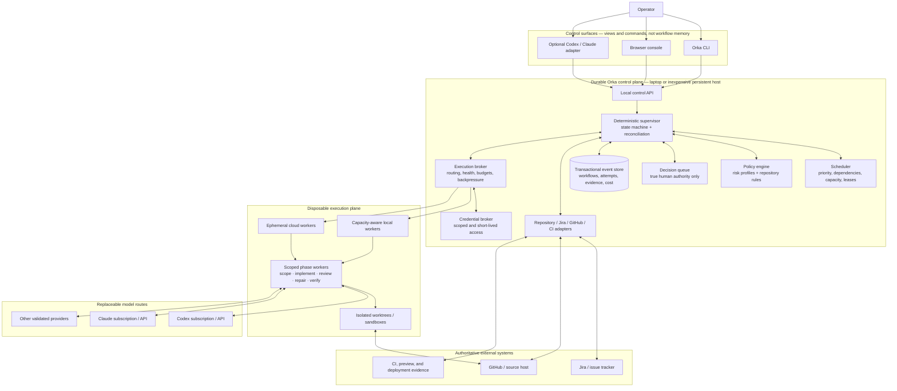

# Orka: one-year product vision

**Horizon:** October 2027

**Status:** Directional product and system-design target

**Tracking:** [GitHub issue #147](https://github.com/Dusttoo/orka/issues/147)

## The vision

Orka is a founder-first engineering runtime that turns a prepared backlog into
independently reviewed, merge-ready software while preserving the operator's
rules, budget, and authority.

It exists first for one person running several serious codebases with the
responsibilities of a small software agency. A useful Orka can be given a
sprint, left running for hours or days, and trusted to make meaningful progress
without either stopping for routine recovery decisions or spending without
bound. The same design naturally serves another solo developer or small team,
but adoption is not the measure of success.

Orka is public because the system and its engineering should be inspectable. It
is also a portfolio: a concrete demonstration of durable workflow design,
distributed-systems thinking, safety engineering, provider integration, and
practical developer experience. Stars, growth, and a hosted business are
optional outcomes, not product requirements.

## The one-year promise

Within one year, an operator should be able to:

1. Install Orka on a laptop or inexpensive persistent host.
2. connect a repository and its issue tracker;
3. select or customize a risk profile;
4. start a ticket, release, or sprint from a stable CLI or browser console;
5. leave it running while Orka scopes, decomposes, implements, reviews,
   repairs, recovers, and drains merge-ready work;
6. return to a concise record of completed work, current activity, cost and
   capacity, plus only the decisions that genuinely require a human.

Switching between Codex, Claude, direct APIs, or future execution providers
must not replace the supervisor, lose workflow context, or require a new
orchestration conversation. Models perform bounded engineering phases; they do
not own the durable process.

## Who it is for

### Primary operator

The primary operator is Orka's maintainer: a solo founder managing multiple
repositories, shared infrastructure, sensitive application data, and both
commercial and hobby projects. The system must work well for that reality
before it is generalized for anyone else.

### Transferable users

The same capabilities may be useful to:

- solo developers with more backlog than uninterrupted attention;
- small engineering teams that need repeatable repository policy;
- consultants and small agencies working across client codebases; and
- maintainers who want inspectable autonomous contributions rather than an
  opaque code generator.

These are beneficiaries of a sound design, not personas Orka must optimize for
at the expense of its primary operator.

## Product principles

1. **Founder-first, generally useful.** Solve the maintainer's real workflow;
   generalize stable abstractions rather than speculative market requirements.
2. **The supervisor is software, not a chat.** Scheduling, state transitions,
   retries, leases, budgets, and recovery are deterministic runtime concerns.
   Models receive bounded jobs and return evidence.
3. **Repository policy is declarative.** Code quality can remain consistently
   high while security, approval, visual QA, deployment, and compliance depth
   vary by repository risk.
4. **Human attention is the scarce resource.** Orka should resolve mechanical
   failures itself and interrupt only for product authority, security
   trade-offs, credentials, destructive actions, or an exhausted declared
   boundary.
5. **Safety gates merges, not ordinary progress.** Work can be retried,
   repaired, rescheduled, or decomposed without weakening exact-head review and
   merge requirements.
6. **Context is durable evidence.** A provider switch loads a canonical ticket
   packet, decisions, repository map, attempt history, and artifacts. It does
   not depend on a long-lived model conversation remembering them.
7. **Provider and host are replaceable resources.** Subscription sessions,
   direct APIs, local machines, and remote workers are execution pools with
   capabilities, limits, health, and cost—not the identity of Orka.
8. **Local-first does not mean laptop-bound.** The complete system must run on
   one machine, while an optional hybrid mode moves heavy work to disposable
   workers without requiring an expensive always-on server.
9. **Everything important is observable and reversible.** The operator can see
   why work is waiting, what authority was used, what it cost, and how to resume
   it without editing opaque state.
10. **Open source is evidence.** Documentation, tests, migrations, issue
    structure, and contributor experience should display the same engineering
    quality Orka enforces in downstream repositories.

## Future-state system design

### How to read the diagram

- **Control surfaces are replaceable.** Closing a Codex or Claude session does
  not stop the sprint or erase its context. The CLI and browser read the same
  durable state and issue commands through the same API.
- **The control plane stays small and persistent.** It owns workflow truth,
  reconciliation, budget, leases, and decisions. It does not run every build or
  carry model conversations forever.
- **The execution plane is disposable.** Workers can run locally when capacity
  permits or on short-lived remote machines when a build needs more CPU or
  memory. A dead worker loses a lease, not the sprint.
- **Models are workers behind a contract.** Provider-specific prompts and
  payloads live behind adapters. Every phase receives explicit inputs and must
  return a validated result and evidence envelope.
- **External systems remain authoritative for their facts.** Orka reconciles
  Jira state, GitHub PRs, and CI results rather than inventing or manually
  reconstructing them.

## Core product experience

### 1. Configure policy once

Repositories select a baseline profile and override explicit rules. Suggested
built-in profiles are:

| Profile | Intended use | Constant quality floor | Additional gates |
| --- | --- | --- | --- |
| `hobby` | Low-risk personal projects | Tests, independent code review, exact-head merge evidence | Security and visual QA only when triggered |
| `production` | Customer-facing software | Full test/build evidence, code review, bounded repair | Security-sensitive design, deployment and migration checks |
| `sensitive` | Regulated or sensitive data | Production floor plus strict trust-boundary and data-flow review | Mandatory security review, stronger approval and credential policy |
| `infrastructure` | Cloud and operational code | Reproducible plans, rollback and ownership evidence | Destructive-action authority, state and credential safeguards |

Profiles are starting points, not hidden modes. Their resolved policy is
inspectable, versioned, and testable.

### 2. Start work from a stable surface

The operator can start one ticket or a sprint from the CLI, later open the
browser, and see the same workflow. Commands are intent-level—start, pause,
resume, approve, reject, cap, reprioritize—not instructions to mutate internal
checkpoint files.

### 3. Let the supervisor finish ordinary work

The supervisor continuously reconciles authoritative state, admits work within
capacity, and chooses among:

- continue an authenticated attempt;
- repair an existing PR;
- retry a transient phase with idempotency protection;
- decompose work that exceeds declared complexity;
- re-route around provider or host exhaustion;
- apply backpressure when CPU, memory, unfinished PRs, or cost approach their
  ceilings; or
- request a narrowly scoped human decision.

One ticket's decision or failure does not globally exhaust unrelated work.

### 4. Return to a useful summary

The default status view answers:

- What merged?
- What is actively running, and where?
- What is recoverable without me?
- Which decisions truly require me, and what are the bounded choices?
- What is waiting on an external system?
- What did this sprint cost in money, subscription capacity, time, and host
  pressure?
- What should Orka do next?

## Durable context and provider independence

Orka's durable context is a collection of typed artifacts, not a transcript:

- repository map and applicable instructions;
- normalized ticket and acceptance contract;
- design decisions and reusable operator decisions;
- dependency graph and decomposition lineage;
- current attempt identity, worktree, branch, PR, and exact head;
- review ledger and unresolved findings;
- test, CI, visual, security, and merge evidence;
- usage reservations, settled cost, retry history, and provider health; and
- a compact next-action packet generated from authoritative state.

A new worker receives the smallest complete packet for its phase. Switching
providers changes the executor, not the workflow identity. Provider-specific
features may improve performance, but correctness cannot depend on undocumented
conversation state.

## Capacity without a permanently expensive server

Orka should support three deployment modes with the same state and policy
model:

| Mode | Control plane | Workers | Best for |
| --- | --- | --- | --- |
| Local | Laptop | Capacity-limited local processes | Interactive tickets and low-cost projects |
| Hybrid | Laptop, mini PC, or small VM | Local plus ephemeral remote workers | The primary operator's sustained multi-repo work |
| Self-hosted | Persistent server | Local or elastic remote workers | Teams that already operate shared infrastructure |

The preferred one-year architecture is **hybrid**: keep an inexpensive
supervisor alive, scale execution only while useful work exists, and enforce
memory/CPU-aware admission on the laptop. Orka must never infer that low CPU
means work is safe to terminate; workers report milestones and hold expiring
leases.

## Autonomy boundary

Orka should handle these without routine operator intervention:

- transient provider and network failures;
- worker crashes and lost responses;
- stale leases and duplicate launches;
- validated continuation of preserved work;
- bounded repair and re-review;
- safe ticket decomposition under repository policy;
- CI repair when findings are mechanical and within scope;
- provider failover when an equivalent approved route exists; and
- capacity throttling and rescheduling.

Orka should stop for the operator when the next step requires:

- a product choice not established by repository policy;
- a security, privacy, schema, migration, or compatibility trade-off with no
  pre-authorized answer;
- new credentials or access to a protected environment;
- destructive or production authority;
- accepting known failed evidence or debt;
- exceeding a declared monetary, attempt, or time boundary after autonomous
  recovery has been exhausted; or
- changing the repository's governance itself.

Every stop must include the evidence, the smallest useful set of choices, the
impact of each choice, and the exact continuation that follows.

## One-year scope

### Required foundation

These capabilities make the vision credible rather than aspirational:

- the Orka 2.0 transactional supervisor and event store;
- deterministic recovery, idempotency, and crash-safe state transitions;
- a stable, scriptable CLI backed by a local control API;
- provider-neutral phase contracts and validated structured results;
- capacity-, dependency-, WIP-, and budget-aware scheduling;
- first-class GitHub, issue-tracker, CI, and workspace adapters;
- policy profiles with an inspectable resolved configuration;
- observable workflow timelines, reason codes, decisions, costs, and health;
- tested migrations, compatibility checks, and rollback-safe upgrades; and
- mechanical exact-head review and merge authority.

### One-year product layer

After the foundation is trustworthy:

- a browser console for sprint progress, evidence, decisions, and controls;
- hybrid execution with short-lived remote workers;
- scoped credential brokering and stronger worker isolation;
- reusable repository templates and guided configuration diagnostics;
- multi-repository coordination for declared shared resources such as a
  database migration sequence; and
- performance reports that distinguish productive engineering work from
  retries, waiting, and orchestration overhead.

### Deliberately deferred

- a required hosted SaaS or multi-tenant control plane;
- enterprise identity, billing, sales, or marketplace features;
- fully autonomous product management;
- production deployment authority by default;
- high-availability distributed scheduling for its own sake; and
- maximizing lane count without regard to completion throughput.

## Roadmap relationship

The current issue groups are the implementation path rather than a separate
vision backlog:

1. **Orka 2.0 supervisor foundation — issue #81 and its ordered slices.** Move
   workflow truth from conversational orchestration into a transactional,
   deterministic supervisor.
2. **Production hardening — issue #136 and its ordered slices.** Make lifecycle,
   adapters, recovery, upgrades, observability, policy, security, and operator
   controls dependable enough for unattended use.
3. **Platform evolution — issue #146 and its ordered slices.** Add durable
   surfaces, provider-independent execution, hybrid workers, isolation, and
   multi-repository coordination on top of the proven runtime.

New issues should name which layer they strengthen. A feature that bypasses the
transactional supervisor, duplicates workflow truth in a UI, or makes a model
session the durable captain conflicts with this vision.

## Success measures

The north-star measure is **accepted engineering work per hour of operator
attention**, not tokens, model turns, tickets started, or simultaneous lanes.

One-year health should be visible through:

- percentage of ready tickets reaching merge without operator intervention;
- operator decisions per ten completed tickets, grouped by legitimate product
  authority versus tooling failure;
- median time from Ready to verified merge;
- recovery success after worker, provider, host, or controller interruption;
- provider-switch success without workflow reconstruction;
- first-pass design and review acceptance, repeat findings, and repair cycles;
- cost and subscription capacity consumed per merged PR;
- time spent actively executing versus waiting or retrying;
- peak local memory/CPU pressure and prevented overload events;
- unfinished-PR age and WIP; and
- unsafe duplicate work, lost evidence, and unverifiable merges—target: zero.

## One-year definition of done

This vision is achieved when the primary operator can run two configured
repositories for a working week from one durable Orka installation, observe and
control them through the CLI or browser, switch approved model routes without
losing context, use local and ephemeral capacity without overloading the laptop,
and spend the majority of their Orka time making genuine product decisions
rather than repairing orchestration state.

The final proof is operational: Orka finishes meaningful work while unattended,
fails safely without deadlocking unrelated work, resumes from durable evidence,
and remains understandable when something goes wrong.
