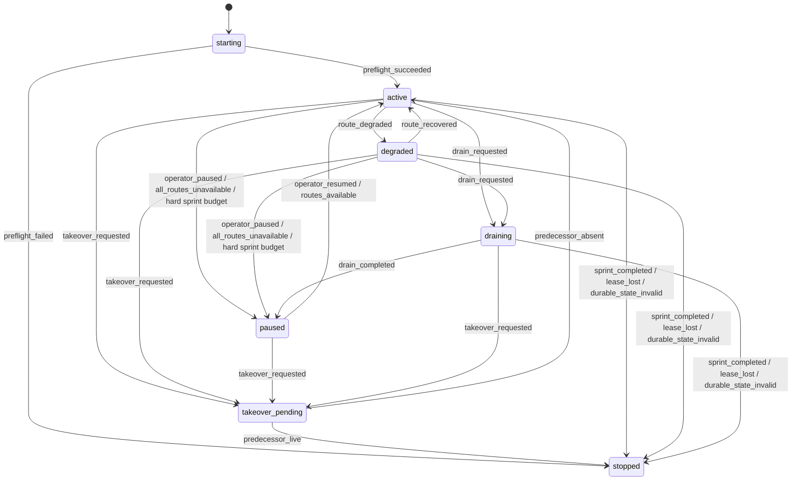
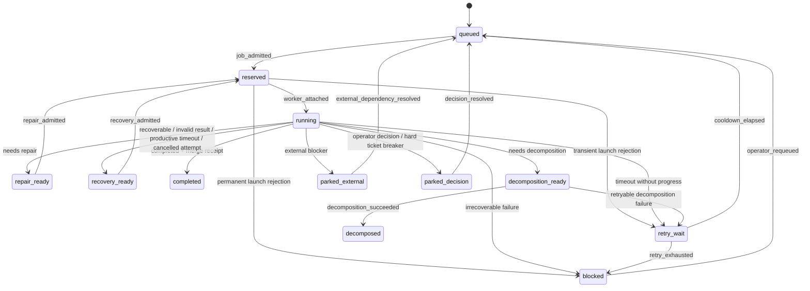

# Durable supervisor lifecycle contract

Contract: `orka.supervisor-lifecycle` schema version 1

Machine-readable source: [`contracts/supervisor-lifecycle-v1.json`](../contracts/supervisor-lifecycle-v1.json)

This contract defines the deterministic boundary between Orka's future durable
supervisor and disposable AI workers. It is a specification and validation
artifact; it does not implement the supervisor loop.

## Invariants

1. The supervisor schedules work but never scopes, implements, reviews, or
   approves a ticket.
2. Every accepted worker terminal result maps to exactly one transition from
   `running`.
3. Ticket-local events can change only that job. They cannot pause or stop the
   supervisor.
4. Queue eligibility is non-consuming. A skipped job remains queued with its
   priority and history intact.
5. Replayed events either become an evidenced no-op, reconcile before becoming
   a no-op, or fail as stale. They never repeat an external side effect blindly.
6. Fresh model context is required across unrelated tickets even when a host
   worker process remains available.
7. Review, security, budget, merge, and destructive-action gates remain
   fail-closed.

The validator enforces the structural forms of these invariants. Runtime work
must additionally authenticate the evidence named for each event.

## Supervisor lifecycle



`degraded` means at least one route is held but useful work may still run.
`paused` means no new work is admitted; the durable process may stay alive for
operator action or a scheduled health probe. `stopped` means the supervisor no
longer owns scheduling authority.

## Job lifecycle



Cancellation of an attempt preserves recoverable ticket work. Explicit
cancellation of the ticket moves any nonterminal job to `cancelled` only after
the execution unit has a terminal receipt.

## Worker terminal results

| Result | Event | Next job state |
|---|---|---|
| `completed` | `worker_completed` | `completed` |
| `needs_repair` | `worker_needs_repair` | `repair_ready` |
| `recoverable` | `worker_recoverable` | `recovery_ready` |
| `needs_decomposition` | `worker_needs_decomposition` | `decomposition_ready` |
| `external_blocked` | `worker_external_blocked` | `parked_external` |
| `operator_decision` | `worker_operator_decision` | `parked_decision` |
| `blocked` | `worker_irrecoverable` | `blocked` |
| `malformed_result` | `worker_result_invalid` | `recovery_ready` |
| `timeout_with_progress` | `worker_timed_out_with_progress` | `recovery_ready` |
| `timeout_without_progress` | `worker_timed_out_without_progress` | `retry_wait` |
| `cancelled_attempt` | `worker_cancelled` | `recovery_ready` |

A malformed result is a bounded worker failure. It is never interpreted by the
supervisor as an ad hoc state or global stop.

## Current controller compatibility

| Orka 1.x ticket state | Contract job state | Interpretation |
|---|---|---|
| `pending` | `queued` | Eligible or waiting work remains durably queued. |
| `running` | `running` | The reserved attempt has an attached execution unit. |
| `completed` | `completed` | Completion still requires authenticated merge evidence. |
| `blocked` | `blocked` | Technical failure is parked until an explicit requeue decision. |
| `decomposed` | `decomposed` | Parent completion remains bound to its exact children. |
| `external_blocked` | `parked_external` | External dependency waits without occupying a lane. |
| `operator_decision` | `parked_decision` | A classified decision waits without stopping other jobs. |
| `user_action` | `parked_decision` | Legacy state must be classified before re-entry. |
| `needs_decomposition` | `decomposition_ready` | Approved decomposition is scheduler work. |
| `needs_repair` | `repair_ready` | Existing PR and ledger remain bound to repair. |
| `recoverable` | `recovery_ready` | Preserved work waits for the recovery predicate. |

The machine-readable validator derives the current state set from
`TERMINAL` and `AUTONOMOUS_INTERVENTIONS` in `sprint-controller.py`, plus
`pending` and `running`. Adding a controller state without updating this map
therefore fails the contract test.

## Scope of stops

Ticket-level events park, recover, retry, decompose, complete, or block one job.
Route incidents move the supervisor to `degraded` while eligible work on healthy
routes continues. New admission stops globally only for:

- explicit operator pause;
- lost repository lease;
- invalid durable state;
- exhausted hard sprint budget;
- all execution routes being unavailable;
- authenticated sprint completion.

Provider cooldowns with a future retry time are waitable work, not sprint
completion.

## Operator-only decisions

Human authority is limited to:

- unresolved product or security policy;
- knowingly accepting a failed gate;
- destructive external actions;
- increasing hard cost, attempt, or repair ceilings;
- genuinely ambiguous external side effects;
- changing the required host, identity, containment, or credential boundary.

Process death, a verified timeout, malformed worker output, and mechanically
proven preserved-PR recovery are runtime concerns.

## Replay and restart

Every event declares one replay policy:

- `no_op_if_applied`: the same evidenced event returns the recorded result.
- `reconcile_then_no_op`: external state is authenticated before returning the
  recorded result or applying the one missing transition.
- `reject_if_stale`: a changed lease, queue version, attempt, or reservation
  rejects the event.

Restart reads the durable event/state record, authenticates live external
receipts, and resumes from the last committed transition. It never infers work
from a model transcript and never repeats an unverified external write.

## Validation

Run:

```bash
python3 scripts/supervisor_contract.py \
  contracts/supervisor-lifecycle-v1.json \
  --controller scripts/sprint-controller.py
```

The validator rejects undefined states/events, ambiguous transitions, missing
current-state mappings, incomplete worker-result mappings, non-global events
that stop the supervisor, invalid replay policy, and weakened queue invariants.

## Rejected alternatives

- **Make an AI worker the next supervisor.** This reintroduces context switching
  and lets model output control authority.
- **Reuse one model conversation across jobs.** This contaminates ticket context
  and makes replay dependent on opaque conversational state.
- **Consume skipped queue entries.** This loses work when exclusions or capacity
  temporarily make a job ineligible.
- **Treat every ambiguity as global exhaustion.** Ticket and route failures must
  be isolated unless a declared global invariant is affected.
- **Repeat external writes after a crash.** Jira, GitHub, provider, and merge
  operations require idempotency keys or authenticated reconciliation.
- **Select persistence in this contract.** The event-store ADR remains issue
  #76; this contract defines semantics independent of storage technology.
